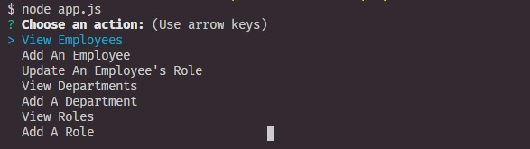
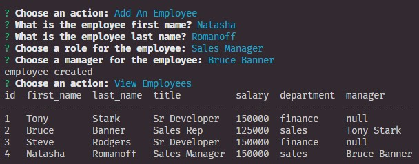

# Employee Tracker  
  -------
  
  ## Table of Contents

  - [Description](#description)
  - [Installation](#installation)
  - [Usage](#usage)
  - [Contributing](#contributing)
  - [Questions](#questions)

  ## Description:
  
  A CLI-run content management system to track a company's departments, roles, employees, salaries, and managers.

 > Available actions in this app:
 >* Add departments, roles, and employees
 >* View departments, roles, and employees
 >* Update employee's role
  

  ## Installation:
  
  Download [the GitHub repository](https://github.com/PatDowner/employeeTracker) and ensure the necessary NPMs are installed.

  NPMs used in this app are:
  * Node
  * Inquirer
  * MySQL2
  * Console.Table
  

  ## Usage:
  
  Run `node app.js` in your terminal from the repo folder and answer the prompts.
  
  

  

  Watch a [video walk-through](https://drive.google.com/file/d/1k3seCaUwCpWMzZSwn1qAHVk9eunXa5ZV/view) for how to use the app.

  ## Contributing:
  
  **Primary:** Pat Downer
  
  **Collaboration:** I worked with several of my classmates as well, especially Brian Ratunil.
  

  ## Questions:
  
  Github Username: [PatDowner](https://github.com/PatDowner)
  
  Contact me via email at: [pat.downer85@gmail.com](mailto:pat.downer85@gmail.com)
  